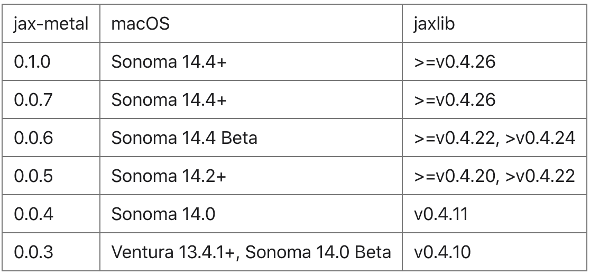

# <center><font size=5> Set Up the Jax-Metal for Apple Silicon GPU on Mac </font>

Open the command window (terminal) and let's do some checks before installing:

1. Check if your Mac device has the Apple Silicon chip. Now jax-metal supports M1, M2 and M3. 

2. Check if the Xcode command-line tool is installed on your Mac. Usually this tool is pre-installed when you get your Mac.

    How to check if it is succesfully installed:  
    ```
    xcode-select -p
    ```
    If your command window shows:
    ```
    /Library/Developer/CommandLineTools
    ```
    Congratulations! You can move to the next step.  
    But if not, you need the code below to install xcode command-line tool:
    ```
    xcode-select --install
    ```
    After installing finishes, you may check it again using the code `xcode-select -p`.
3. Prepare a new environment for jax-metal, you can use conda to create one. The Python edition should be 3.9 or later!
    ```
    conda create -n jax-metal python=3.9
    ```

<br>
Now everything is ready, we can proceed to installing:  

1. Activate your new env by `conda activate jax-metal`.

2. Install jaxlib and jax first. The chart below listed the required version of jaxlib macthing the jax-metal package. You can select the suitable versions of jaxlib according to your mcOS version.  



However!! I highly recommend to choose the olest version among the feasible choices. Take the first line of the chart as an example, you may choose to install the jaxlib of version 0.4.26, because when I install the latest one (0.4.31), the jax-metal cannot recognize my GPU. 

Update: you can use the latest version, only if you set the environment variables by ```export ENABLE_PJRT_COMPATIBILITY=1```.

```
# you need to keep the versions of jax and jaxlib the same
# and here I use pip for installation, conda may also work

pip install jaxlib==0.4.26
pip install jax==0.4.26
```
3. Install jax-metal.
```
pip install jax-metal
```
4. The last step, test if the GPU are working:
```python
import jax

print(jax.devices())
```
If it works, you should see:
```
[METAL(id=0)]
```

ALL DONE, ENJOY!
